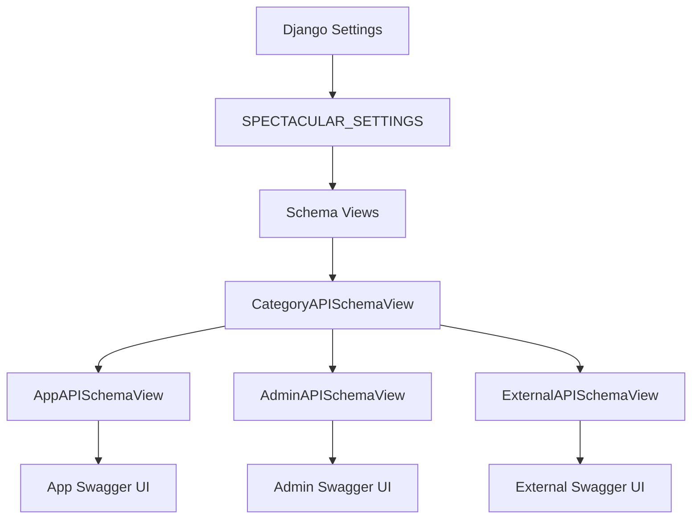

# 🚀 Django Dashboard API Documentation Guide

이 문서는 Django REST Framework와 DRF Spectacular를 사용한 **고급 API 문서화 시스템** 가이드입니다.

## � 목차
1. [빠른 시작](#-빠른-시작)
2. [아키텍처 개요](#-아키텍처-개요)
3. [태그 기반 분류 시스템](#-태그-기반-분류-시스템)
4. [ViewSet 문서화](#-viewset-문서화)
5. [스키마 뷰 구조](#-스키마-뷰-구조)
6. [태그 설명 관리](#-태그-설명-관리)
7. [고급 설정](#-고급-설정)

## 🚀 빠른 시작

### 1. API 문서 접근 URL

| 카테고리 | URL | 설명 | 대상 사용자 |
|----------|-----|------|------------|
| **전체 API** | `/swagger/` | 모든 API 통합 뷰 | 개발자 |
| **App API** | `/swagger/app/` | 일반 앱 기능 API | 프론트엔드 개발자 |
| **Admin API** | `/swagger/admin/` | 관리자 전용 API | 백엔드/관리자 |
| **External API** | `/swagger/external/` | 외부 연동 API | 외부 개발자 |

### 2. 드롭다운 네비게이션 

각 Swagger 페이지 상단에는 **카테고리 전환 드롭다운**이 있어 빠른 이동이 가능합니다.

## 🏗️ 아키텍처 개요



### 핵심 컴포넌트

1. **`CategoryAPISchemaView`**: 베이스 스키마 뷰 클래스
2. **태그 기반 필터링**: 접두사 매칭으로 자동 분류
3. **동적 태그 설명**: 카테고리별 맞춤 설명 표시
4. **커스텀 Swagger 템플릿**: 드롭다운 네비게이션 포함

## 🏷️ 태그 기반 분류 시스템

### � 접두사 매칭 시스템

우리의 태그 시스템은 **접두사 기반 매칭**을 사용하여 API를 자동으로 분류합니다:

```python
# 예시: admin 태그는 다음을 모두 포함
admin          # 기본 관리자 API
admin-user     # 사용자 관리 API  
admin-order    # 주문 관리 API
admin-product  # 상품 관리 API
```

### 📊 카테고리별 태그 매핑

| 카테고리 | 기본 태그 | 확장 태그 | 설명 |
|----------|-----------|-----------|------|
| **App** | `app`, `user` | `app-*`, `user-*` | 일반 사용자 대상 기능 |
| **Admin** | `admin`, `management` | `admin-*`, `management-*` | 관리자 전용 기능 |
| **External** | `external`, `public` | `external-*`, `public-*` | 외부 연동 및 공개 API |

### 🎯 태그 설명 시스템

각 태그에는 **이모지와 함께 상세한 설명**이 자동으로 추가됩니다:

```python
tag_descriptions = {
    'app': '📱 일반 앱 API - 사용자가 직접 사용하는 기본 기능들',
    'user': '👤 사용자 관련 API - 프로필, 인증, 개인정보 관리',
    'admin': '🔧 관리자 API - 시스템 전체 관리 및 모니터링',
    'admin-user': '👥 관리자 사용자 관리 - 사용자 계정 생성/수정/삭제 및 권한 관리',
    'admin-order': '🛒 관리자 주문 관리 - 주문 처리, 상태 변경, 통계 조회',
    'external': '🌐 외부 연동 API - 제3자 서비스 연동 및 웹훅',
}
```

## 📝 ViewSet 문서화

### 🎨 기본 ViewSet 설정 (현재 방식)

```python
from drf_spectacular.utils import extend_schema, extend_schema_view
from rest_framework.viewsets import ModelViewSet

@extend_schema_view(
    list=extend_schema(
        tags=['admin-user'], 
        summary='[관리자] 모든 사용자 조회', 
        description='관리자용 - 비활성 사용자 포함 모든 사용자를 조회합니다.'
    ),
    create=extend_schema(
        tags=['admin-user'], 
        summary='[관리자] 사용자 생성', 
        description='관리자용 - 새로운 사용자를 생성합니다.'
    ),
    retrieve=extend_schema(
        tags=['admin-user'], 
        summary='[관리자] 사용자 상세 조회', 
        description='관리자용 - 특정 사용자의 상세 정보를 조회합니다.'
    ),
    update=extend_schema(
        tags=['admin-user'], 
        summary='[관리자] 사용자 정보 수정', 
        description='관리자용 - 사용자 정보를 전체 수정합니다.'
    ),
    partial_update=extend_schema(
        tags=['admin-user'], 
        summary='[관리자] 사용자 정보 부분 수정', 
        description='관리자용 - 사용자 정보를 부분적으로 수정합니다.'
    ),
    destroy=extend_schema(
        tags=['admin-user'], 
        summary='[관리자] 사용자 삭제', 
        description='관리자용 - 사용자를 삭제합니다.'
    ),
)
class AdminUserViewSet(ModelViewSet):
    """
    👥 관리자용 사용자 관리 ViewSet
    
    시스템의 모든 사용자를 관리할 수 있는 관리자 전용 API입니다.
    
    🔐 권한 요구사항: 관리자 권한 필요
    🛡️ 보안: 모든 API는 관리자 인증이 필요합니다
    """
    queryset = User.objects.all()
    serializer_class = UserSerializer
```

### ⚡ 커스텀 액션 문서화

```python
@extend_schema(
    tags=['admin-user'],
    summary='[관리자] 사용자 강제 비활성화',
    description="""
    **관리자 전용** - 사용자를 강제로 비활성화합니다.
    
    ### 🎯 사용 목적
    - 문제 사용자 계정 비활성화
    - 임시 계정 정지
    - 삭제 대신 안전한 계정 관리
    
    ### 🔄 처리 과정
    1. `is_active`를 `False`로 변경
    2. `deactivated_at` 시간 기록
    3. 사용자 로그인 차단
    """,
    responses={
        200: {
            'description': '✅ 비활성화 성공',
            'examples': {
                'application/json': {
                    'message': '사용자가 비활성화되었습니다.',
                    'deactivated_at': '2023-01-20T14:25:00Z',
                    'user_id': 123,
                    'username': 'john_doe'
                }
            }
        },
        404: {'description': '❌ 사용자를 찾을 수 없음'},
        403: {'description': '❌ 권한 없음 (관리자 권한 필요)'}
    }
)
@action(detail=True, methods=['post'])
def force_deactivate(self, request, pk=None):
    """사용자 강제 비활성화"""
    # 구현 로직
    pass
```
    ## 🏗️ 스키마 뷰 구조

### 📦 CategoryAPISchemaView (베이스 클래스)

우리의 핵심 베이스 클래스입니다:

```python
# config/schema_views.py
class CategoryAPISchemaView(SpectacularAPIView):
    category_tags = []           # 필터링할 태그 목록
    schema_title = ""           # 스키마 제목
    schema_description = ""     # 스키마 설명  
    tag_descriptions = {}       # 태그별 상세 설명
    
    def get(self, request, *args, **kwargs):
        """🔍 접두사 기반 태그 필터링 및 동적 태그 설명 추가"""
        # 1. 전체 스키마 생성
        # 2. 접두사 매칭으로 API 필터링
        # 3. 모든 자식 클래스의 tag_descriptions 수집
        # 4. 사용된 태그에만 설명 추가
        pass
        
    def _get_combined_tag_descriptions(self):
        """🔗 모든 스키마 뷰 클래스의 태그 설명 통합"""
        pass
```

### 🎯 구체적인 스키마 뷰들

각 카테고리별로 특화된 스키마 뷰:

```python
class AppAPISchemaView(CategoryAPISchemaView):
    category_tags = ['app', 'user']
    schema_title = 'App APIs' 
    schema_description = '일반 애플리케이션 API 문서'
    tag_descriptions = {
        'app': '📱 일반 앱 API - 사용자가 직접 사용하는 기본 기능들',
        'user': '👤 사용자 관련 API - 프로필, 인증, 개인정보 관리'
    }

class AdminAPISchemaView(CategoryAPISchemaView):
    category_tags = ['admin', 'management'] 
    schema_title = 'Admin APIs'
    schema_description = '관리자 전용 API 문서'
    tag_descriptions = {
        'admin': '🔧 관리자 API - 시스템 전체 관리 및 모니터링',
        'admin-user': '👥 관리자 사용자 관리 - 사용자 계정 생성/수정/삭제 및 권한 관리',
        'admin-order': '🛒 관리자 주문 관리 - 주문 처리, 상태 변경, 통계 조회',
        'admin-product': '📦 관리자 상품 관리 - 상품 등록, 수정, 재고 관리',
        'management': '⚙️ 시스템 관리 - 설정, 통계, 모니터링 도구'
    }
```

### 🎨 커스텀 Swagger 뷰

드롭다운 네비게이션을 지원하는 Swagger 뷰:

```python
class CustomSwaggerView(SpectacularSwaggerView):
    """🎛️ 드롭다운 네비게이션이 있는 커스텀 Swagger 뷰"""
    custom_schema_url_name = None
    custom_title = None
    
class AdminAPIsSwaggerView(CustomSwaggerView):
    custom_schema_url_name = 'admin-schema'
    custom_title = 'Admin APIs'
```

## 🏷️ 태그 설명 관리

### 🔄 중앙 집중식 태그 관리

모든 태그 설명은 각 스키마 뷰에서 정의하고, `_get_combined_tag_descriptions()` 메서드가 자동으로 통합합니다:

```python
def _get_combined_tag_descriptions(self):
    """🔗 모든 스키마 뷰 클래스의 tag_descriptions를 합쳐서 반환"""
    combined = {}
    
    # 현재 클래스의 tag_descriptions 추가
    combined.update(self.tag_descriptions)
    
    # 다른 스키마 뷰 클래스들도 합침
    schema_classes = [AppAPISchemaView, AdminAPISchemaView, ExternalAPISchemaView]
    for schema_class in schema_classes:
        if hasattr(schema_class, 'tag_descriptions'):
            combined.update(schema_class.tag_descriptions)
    
    return combined
```

### ✨ 동적 태그 설명 표시

각 카테고리에서는 **실제로 사용되는 태그에만** 설명이 표시됩니다:

- **App API**: `app`, `user` 태그 설명만 표시
- **Admin API**: `admin-user`, `admin-order` 등 관리자 태그 설명만 표시  
- **External API**: `external`, `public` 태그 설명만 표시
class UserViewSet(ModelViewSet):
    queryset = User.objects.all()
    serializer_class = UserSerializer
```

### 개별 액션에 태그 설정

```python
@extend_schema_view(
    list=extend_schema(tags=['admin']),
    create=extend_schema(tags=['admin']),
)
class AdminUserViewSet(ModelViewSet):
    queryset = User.objects.all()
    serializer_class = UserSerializer

    @extend_schema(
        tags=['admin', 'management'],
        summary='사용자 활성화/비활성화',
        description='사용자 계정을 활성화하거나 비활성화합니다.',
        responses={200: {'description': '성공적으로 변경됨'}}
    )
    @action(detail=True, methods=['post'])
    def toggle_active(self, request, pk=None):
        user = self.get_object()
        user.is_active = not user.is_active
        user.save()
        return Response({'status': 'active' if user.is_active else 'inactive'})
```

## 🔧 APIView에서 Swagger 작성

### 기본 APIView

```python
from rest_framework.views import APIView
from rest_framework.response import Response
from drf_spectacular.utils import extend_schema

class UserStatsView(APIView):
    @extend_schema(
        tags=['app', 'stats'],
        summary='사용자 통계',
## ⚙️ 고급 설정

### 🔧 settings.py 설정

```python
# config/settings.py
SPECTACULAR_SETTINGS = {
    "TITLE": "Django Dashboard API",
    "DESCRIPTION": "API documentation for Django Dashboard application", 
    "VERSION": "1.0.0",
    "SERVE_INCLUDE_SCHEMA": False,
    "SCHEMA_PATH_PREFIX": r"/api/v[0-9]",
    "DEFAULT_GENERATOR_CLASS": "drf_spectacular.generators.SchemaGenerator",
    "SERVE_PERMISSIONS": ["rest_framework.permissions.AllowAny"],
    "SERVE_AUTHENTICATION": [],
    "SWAGGER_UI_DIST": "SIDECAR",
    "SWAGGER_UI_FAVICON_HREF": "SIDECAR", 
    "REDOC_DIST": "SIDECAR",
    "SWAGGER_UI_SETTINGS": {
        "deepLinking": True,
        "persistAuthorization": True,
        "displayOperationId": False,
        "displayRequestDuration": True,
        "filter": True,
        "showExtensions": True,
        "showCommonExtensions": True, 
        "tryItOutEnabled": True,
        "defaultModelsExpandDepth": 1,
        "defaultModelExpandDepth": 1,
        "docExpansion": "list",
    },
    "COMPONENT_SPLIT_REQUEST": True,
    "SORT_OPERATIONS": False,
    # ❌ TAGS 설정 제거됨 - 각 스키마 뷰에서 개별 관리
}
```

### �️ URL 구성

```python
# config/urls.py
from .schema_views import (
    AppAPISchemaView, AdminAPISchemaView, ExternalAPISchemaView,
    AppAPIsSwaggerView, AdminAPIsSwaggerView, ExternalAPIsSwaggerView
)

schema_patterns = [
    # 🌐 스키마 JSON 엔드포인트
    path('api/schema/', SpectacularAPIView.as_view(), name='schema'),
    path('api/schema/app/', AppAPISchemaView.as_view(), name='app-schema'), 
    path('api/schema/admin/', AdminAPISchemaView.as_view(), name='admin-schema'),
    path('api/schema/external/', ExternalAPISchemaView.as_view(), name='external-schema'),
    
    # 🎨 Swagger UI 엔드포인트
    path('swagger/', AllAPIsSwaggerView.as_view(), name='swagger-ui'),
    path('swagger/app/', AppAPIsSwaggerView.as_view(), name='app-swagger-ui'),
    path('swagger/admin/', AdminAPIsSwaggerView.as_view(), name='admin-swagger-ui'), 
    path('swagger/external/', ExternalAPIsSwaggerView.as_view(), name='external-swagger-ui'),
]
```

### 📁 파일 구조

```
config/
├── schema_views.py      # 🏗️ 스키마 뷰 클래스들
├── views.py            # 🎯 API ViewSet들  
├── urls.py             # 🛤️ URL 패턴
└── settings.py         # ⚙️ Django 설정

templates/drf_spectacular/
└── swagger-ui.html     # 🎨 커스텀 Swagger 템플릿 (드롭다운 포함)

user/
├── views.py           # 👤 사용자 관련 ViewSet
├── serializers.py     # 📄 사용자 시리얼라이저
└── urls.py            # 🛤️ 사용자 URL 패턴
```

## 📋 체크리스트

### ✅ API 작성 시 확인 사항

- [ ] **적절한 태그 설정** (`admin-user`, `app`, `external` 등)
- [ ] **명확한 summary와 description** (이모지 포함 권장)
- [ ] **접두사 기반 태그명** (`admin-*`, `app-*` 형태)
- [ ] **응답 예시 제공** (성공/실패 케이스)
- [ ] **Markdown 문법 활용** (목록, 강조, 코드 블록)
- [ ] **권한 정보 명시** (관리자 필요, 인증 필요 등)

### 🎯 문서 품질 향상 팁

1. **🏷️ 일관된 태그명**: 접두사 규칙 준수 (`admin-user`, `admin-order`)
2. **📝 상세한 설명**: Markdown 형식으로 구조화된 설명
3. **💡 실제 예제**: 실제 사용 가능한 JSON 예제 데이터
4. **❌ 에러 처리**: HTTP 상태 코드별 에러 케이스 문서화
5. **🔄 동기화**: API 변경 시 태그 설명도 함께 업데이트

### � 주의사항

- **태그 중복 방지**: 같은 기능을 여러 태그로 분산시키지 말 것
- **접두사 일관성**: `admin-`, `app-`, `external-` 패턴 유지
- **설명 동기화**: ViewSet 변경 시 tag_descriptions도 업데이트
- **테스트 확인**: 각 카테고리별 Swagger에서 올바른 API만 표시되는지 확인

## 🎉 완성된 결과물

이 시스템을 통해 다음과 같은 **고품질 API 문서**를 얻을 수 있습니다:

1. **🎯 카테고리별 분리된 문서**: 사용자 유형에 맞는 맞춤형 문서
2. **🏷️ 자동 태그 분류**: 접두사 매칭으로 유지보수 간편
3. **💡 동적 설명 표시**: 각 카테고리에서 관련 태그만 표시
4. **🎨 사용자 친화적 UI**: 드롭다운 네비게이션과 이모지 활용
5. **🔄 중앙 집중식 관리**: 태그 설명을 한 곳에서 통합 관리

---

**📚 이 가이드를 활용하여 일관되고 전문적인 API 문서를 작성하세요!**
